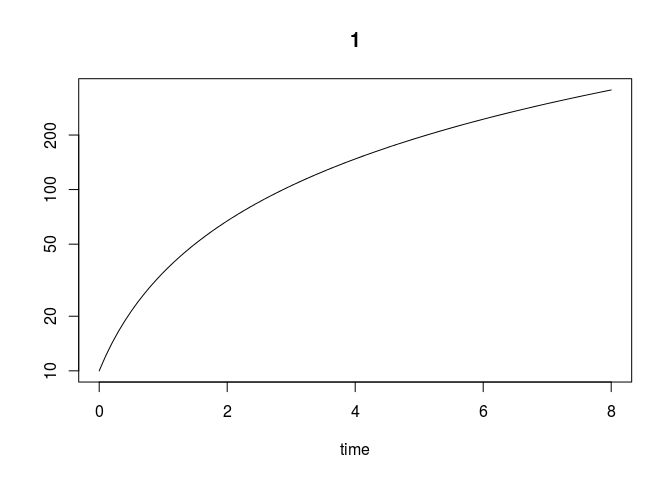
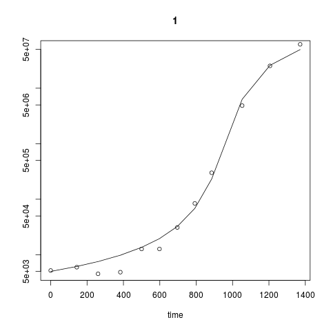
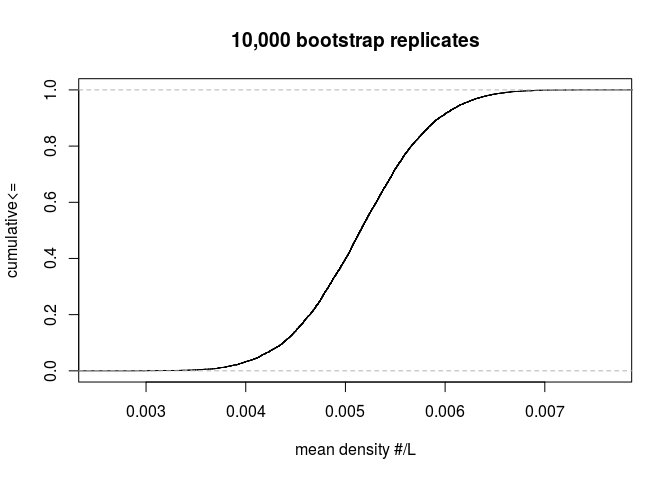
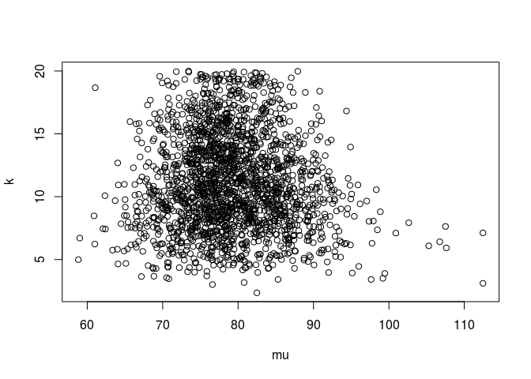

# QMRA R Code

## The R code from QMRA, 2nd Ed.

This document describes a process to extract, clean-up, and run the R code from:

[Quantitative Microbial Risk Assessment, 2nd Edition](http://www.wiley.com/WileyCDA/WileyTitle/productCd-1118145291,subjectCd-CH20.html) 
by Charles N. Haas, Joan B. Rose, and Charles P. Gerba. (Wiley, 2014).

This is the copyright statement for the book:

> © Haas, Charles N.; Rose, Joan B.; Gerba, Charles P., Jun 02, 2014, 
> Quantitative Microbial Risk Assessment Wiley, Somerset, ISBN: 9781118910528

We have been licensed by Wiley to post the R-code "figures" from the book
on [https://github.com/brianhigh/envh543](https://github.com/brianhigh/envh543).

Here is our [RightsLink](http://www.copyright.com/) license number:

```
License Date: Mar 18, 2016
License Number: 3831970414111
Type Of Use: Website
```

The R-code has been modified so that it will run and will be more readable. The 
original code snippets published in the book were generally too buggy to use 
without these modifications. The most common error was to use `< -` for
assignment instead of `<-`. These issues resulted in unrecoverable errors. These
and other errors have been fixed in the code below.

## Extract the code from the PDF

The text book is 
[available as an eBook](http://alliance-primo.hosted.exlibrisgroup.com/UW:all:CP51230982940001451) 
from UW Libraries.

The PDF was created by printing select pages from EBL Reader and saving the 
result as PDF.


An alternative way to extract the pages containing R code using `bash` is to use 
`wget` to fetch the PDF ebook file from the web and extract pages with `pdftk`. 
For this, we can use a link the PDF ebook file on the web as provided by Wiley.


```bash
wget -O QMRA2.pdf 'https://onlinelibrary.wiley.com/doi/pdf/10.1002/9781118910030'
pdftk QMRA2.pdf cat 234 257 259 321 338-340 342 output QMRA2_extract.pdf
```

These `bash` commands will extract the R code from the PDF and list the figures. 


```bash
pdftotext \
    "QMRA2_extract.pdf" \
    "QMRA2_extract.txt"

egrep -i 'R function|R code|R listing|listing in R|code snippet' \
    "QMRA2_extract.txt"
```

After that, any extra text may be removed using a text editor.

## Code listings in the text

- Figure 6.17 R functions for solution of Example 6.9. (p. 228)
- Figure 7.10 R code to compute generalized logistic growth equation. (p. 251)
- Figure 7.11 R listing for fitting Listeria data. (p. 253)
- Figure 8.14 Program listing in R to compute best-fit parameters. (p. 315)
- Figure 9.5 R code for bootstrap analysis of mean density for data in Table 6.5. (p. 333)
- Figure 9.7 R code for determining the posterior distribution for the negative binomial. (p. 334)
- Figure 9.9 Code snippet for generating samples from posterior for negative binomial. (p. 337)

## Clear the workspace


```r
# Clear the workspace, unless you are running in knitr context.
if (!isTRUE(getOption('knitr.in.progress'))) {
    closeAllConnections()
    rm(list = ls())
}
```

## Load packages

Define a function to auto-install and load required packages.


```r
# Load one or more packages into memory, installing as needed.
load.pkgs <- function(pkgs, repos = "http://cran.r-project.org") {
    result <- sapply(pkgs, function(pkg) { 
        if (!suppressWarnings(require(pkg, character.only = TRUE))) {
            install.packages(pkg, quiet = TRUE, repos = repos)
            library(pkg, character.only = TRUE)}})
}
```

Use the this function to load the packages we will need.


```r
# Load packages, installing as needed.
load.pkgs(c("deSolve", "boot", "cubature", "lattice"))
```

## Figure 6.17

From: CHAPTER 6 EXPOSURE ASSESSMENT, p. 228 

Figure 6.17 R functions for solution of Example 6.9.


```r
# © Haas, Charles N.; Rose, Joan B.; Gerba, Charles P., Jun 02, 2014, 
# Quantitative Microbial Risk Assessment Wiley, Somerset, ISBN: 9781118910528

volume <- c(0.032, 0.026, 0.021, 0.018, 0.016, 0.011, 0.005)
n <- c(29, 30, 28, 30, 29, 25, 30)
p <- c(7, 4, 3, 4, 2, 2, 2)
mu_i <- -(1 / volume) * log((n - p) / n)
data <- data.frame(volume, n, p, mu_i)

LnL <- function(guess, data) {
    tmp <- volume * (guess - mu_i) * (n - p) - p * 
        log((1 - exp(-guess * volume)) / (1 - exp(-mu_i * volume)))
    sum(tmp)
}

LnL(1, data)
```

```
## [1] 26.98308
```

```r
best <-
  optim(
    .5, LnL, gr = NULL, method = 'BFGS', control = list(trace = 12, REPORT = 1)
  )
```

```
## initial  value 41.888275 
## iter   2 value 2.241312
## iter   3 value 2.086770
## iter   4 value 1.200017
## iter   5 value 1.055462
## iter   6 value 1.023437
## iter   7 value 1.023008
## iter   8 value 1.023007
## iter   9 value 1.023006
## iter   9 value 1.023006
## iter   9 value 1.023006
## final  value 1.023006 
## converged
```

```r
show(best)
```

```
## $par
## [1] 6.948856
## 
## $value
## [1] 1.023006
## 
## $counts
## function gradient 
##       14        9 
## 
## $convergence
## [1] 0
## 
## $message
## NULL
```


## Figure 7.10

From: TYPES OF GROWTH PROCESSES, p. 251 

Figure 7.10 R code to compute generalized logistic growth equation.


```r
# © Haas, Charles N.; Rose, Joan B.; Gerba, Charles P., Jun 02, 2014, 
# Quantitative Microbial Risk Assessment Wiley, Somerset, ISBN: 9781118910528

library("deSolve")
genlogist <- function(t, N, params) {
    # Generalized logistic with zero, one, two and three parameters
    # (other than k and K)
    k <- params[1]
    K <- params[2]
    theta1 <- 1
    theta2 <- 1
    theta3 <- 1
    model <- params[6]
    if (model > 0)
        theta1 <- params[3]
    if (model > 1)
        theta2 <- params[4]
    if (model > 2)
        theta3 <- params[5]
    dydt <- k * (N^theta2) * (1 - (N / K)^theta1)^theta3
    list(dydt)
}

# Should be equal to the number of thetas <> 1
model <- 3 

10 -> k
1e6 -> K
.7 -> theta1
.3 -> theta2
.5 -> theta3
params <- c(k, K, theta1, theta2, theta3, model)
N0 <- 1e1
times <- seq(0, 8, by = 0.1)
y <- ode(N0, times, genlogist, params, method = 'adams')
plot(y, log = "y")
```



```r
print(y)
```

```
##    time         1
## 1   0.0  10.00000
## 2   0.1  12.05308
## 3   0.2  14.21708
## 4   0.3  16.48483
## 5   0.4  18.85035
## 6   0.5  21.30850
## 7   0.6  23.85483
## 8   0.7  26.48544
## 9   0.8  29.19687
## 10  0.9  31.98601
## 11  1.0  34.85007
## 12  1.1  37.78652
## 13  1.2  40.79304
## 14  1.3  43.86750
## 15  1.4  47.00796
## 16  1.5  50.21261
## 17  1.6  53.47976
## 18  1.7  56.80786
## 19  1.8  60.19545
## 20  1.9  63.64115
## 21  2.0  67.14368
## 22  2.1  70.70183
## 23  2.2  74.31446
## 24  2.3  77.98049
## 25  2.4  81.69889
## 26  2.5  85.46869
## 27  2.6  89.28897
## 28  2.7  93.15885
## 29  2.8  97.07748
## 30  2.9 101.04407
## 31  3.0 105.05784
## 32  3.1 109.11807
## 33  3.2 113.22406
## 34  3.3 117.37511
## 35  3.4 121.57060
## 36  3.5 125.80988
## 37  3.6 130.09237
## 38  3.7 134.41748
## 39  3.8 138.78465
## 40  3.9 143.19335
## 41  4.0 147.64305
## 42  4.1 152.13326
## 43  4.2 156.66349
## 44  4.3 161.23326
## 45  4.4 165.84212
## 46  4.5 170.48963
## 47  4.6 175.17536
## 48  4.7 179.89889
## 49  4.8 184.65982
## 50  4.9 189.45776
## 51  5.0 194.29232
## 52  5.1 199.16314
## 53  5.2 204.06985
## 54  5.3 209.01211
## 55  5.4 213.98957
## 56  5.5 219.00189
## 57  5.6 224.04876
## 58  5.7 229.12986
## 59  5.8 234.24487
## 60  5.9 239.39350
## 61  6.0 244.57545
## 62  6.1 249.79043
## 63  6.2 255.03817
## 64  6.3 260.31839
## 65  6.4 265.63081
## 66  6.5 270.97519
## 67  6.6 276.35126
## 68  6.7 281.75877
## 69  6.8 287.19747
## 70  6.9 292.66713
## 71  7.0 298.16751
## 72  7.1 303.69837
## 73  7.2 309.25950
## 74  7.3 314.85067
## 75  7.4 320.47166
## 76  7.5 326.12225
## 77  7.6 331.80225
## 78  7.7 337.51145
## 79  7.8 343.24963
## 80  7.9 349.01662
## 81  8.0 354.81220
```


## Figure 7.11

From: TYPES OF GROWTH PROCESSES, p. 253

Figure 7.11 R listing for fitting Listeria data.


```r
# © Haas, Charles N.; Rose, Joan B.; Gerba, Charles P., Jun 02, 2014, 
# Quantitative Microbial Risk Assessment Wiley, Somerset, ISBN: 9781118910528

# Fit listeria data - 1.5o skim milk
# Xanthiakos, K., D. Simos, A. S. Angelidis, G. J. Nychas and K. Koutsoumanis (2006).
# "Dynamic modeling of Listeria monocytogenes growth in pasteurized milk."
# Journal of Applied Microbiology 100(6): 1289-1298.

# Time in hours
time <-
    c(0, 143.39622, 260.37735, 383.01886, 500, 598.11322, 696.22644, 
      792.45282, 884.90564, 1052.8302, 1205.6604, 1371.69812)

# N CFU/mL
N <-
    c(5204.991205, 5972.002763, 4536.49044, 4859.258466, 12719.79172, 
      12719.79172, 31084.22186, 84211.22791, 300337.8033, 4859258.466, 
      25292397.58, 61807332.42)

A <- data.frame(time=time, N=N, lnN=log(N))
attach(A)
```

```
## The following objects are masked _by_ .GlobalEnv:
## 
##     N, time
```

```r
#---------------------------------------------
ObjFunc <- function(paramsin) {
    # Computes ESS
    if (modell==0) {
       paramsin["theta1"] <- 1
       paramsin["theta2"] <- 1
       paramsin["theta3"] <- 1}

    if (modell==1) {
       paramsin["theta2"] <- 1
       paramsin["theta3"] <- 1}

    if (modell==2) {
       paramsin["theta3"] <- 1}

    params <-
        c(exp(paramsin["lnk"]), exp(paramsin["lnK"]), paramsin["theta1"], 
          paramsin["theta2"], paramsin["theta3"], modell)

    y <- ode(N0, timepoints, genlogist, params, method="daspk")
    pred <- y[, "1"]
    ESS <- log(obsN) - log(pred)

    A <- c(ESS^2)
    ESS <- sum(A)
    plot(y, log="y")
    points(timepoints, obsN)
    working <<- data.frame(t=timepoints, obsN=obsN, predN=pred)
    return(ESS)
}

#---------------------------------------------
timepoints <<- A$time
N0 <<- 5000
obsN <<- A$N
modell <<- 3
params <- c()
params["lnk"] <- -4.69
params["lnK"] <- 33.64
params["theta1"] <- 0.0615
params["theta2"] <- 3.69
params["theta3"] <- 103.534
png("best.png")
best <- optim(params, ObjFunc, gr=NULL, method="Nelder-Mead", 
            control=list(trace=6, reltol=1e-10, maxit=5000))
#best <- genoud(ObjFunc,
#    nvars=6, pop.size=20, starting.values=params, optim.method="Nelder-Mead")
dev.off()
```




```r
print(best)
```

```
## $par
##          lnk          lnK       theta1       theta2       theta3 
##  -4.75387114  33.66206091   0.06180266   3.71374598 105.27707773 
## 
## $value
## [1] 1.172276
## 
## $counts
## function gradient 
##      951       NA 
## 
## $convergence
## [1] 10
## 
## $message
## NULL
```

```r
print(working)
```

```
##            t         obsN        predN
## 1     0.0000     5204.991     5000.000
## 2   143.3962     5972.003     6143.760
## 3   260.3773     4536.490     7532.750
## 4   383.0189     4859.258     9810.019
## 5   500.0000    12719.792    13583.700
## 6   598.1132    12719.792    19515.141
## 7   696.2264    31084.222    32271.285
## 8   792.4528    84211.228    68389.882
## 9   884.9056   300337.803   230430.195
## 10 1052.8302  4859258.466  6315294.051
## 11 1205.6604 25292397.580 25791994.529
## 12 1371.6981 61807332.420 49686290.127
```

## Figure 8.14

From APPENDIX, p. 315

Figure 8.14 Program listing in R to compute best-fit parameters.


```r
# © Haas, Charles N.; Rose, Joan B.; Gerba, Charles P., Jun 02, 2014, 
# Quantitative Microbial Risk Assessment Wiley, Somerset, ISBN: 9781118910528

dose <- c(90000, 9000, 900, 90, 9, 0.9, 0.09, 0.009)
total <- c(3, 7, 8, 9, 11, 7, 7, 7)
positives <- c(3, 5, 7, 8, 8, 1, 0, 0)
dataframe <- data.frame(dose = dose, total = total, positives = positives)

#--------------------------------------------------------------
# Function to Return Predicted Value Given Parameters
pred.betaPoisson <- function(alpha, N50, data) {
    f <- 1 - (1 + data$dose * (2^(1 / alpha) - 1) / N50)^-alpha
    return(f)
}

#--------------------------------------------------------------
# Function to Return Deviance
deviance <- function(params, data) {
    alpha <- params[1]
    N50 <- params[2]
    fpred <- pred.betaPoisson(alpha, N50, data)
    fobs <- data$positives / data$total
    
    # We add small number to prevent taking log(0)
    Y1 <- data$positives * log(fpred / (fobs + 1e-15)) 
    Y2 <- (data$total - data$positives) * log((1 - fpred) / (1 - fobs + 1e-15))
    Y <- -2 * (sum(Y1) + sum(Y2))
    return(Y)
}

#--------------------------------------------------------------

best <-
  optim(
    c(0.5, 10), deviance, gr = NULL, dataframe, method = "Nelder-Mead", 
    control = list(trace = 10)
  )
```

```
##   Nelder-Mead direct search function minimizer
## function value for initial parameters = 11.552015
##   Scaled convergence tolerance is 1.72138e-07
## Stepsize computed as 1.000000
## BUILD              3 38.993301 11.552015
## HI-REDUCTION       5 25.353893 11.552015
## HI-REDUCTION       7 18.369971 11.552015
## REFLECTION         9 11.842167 7.615474
## REFLECTION        11 11.552015 7.391945
## HI-REDUCTION      13 8.799138 7.391945
## HI-REDUCTION      15 7.853183 7.391945
## HI-REDUCTION      17 7.615474 7.391945
## EXTENSION         19 7.578069 7.282229
## EXTENSION         21 7.391945 6.887240
## LO-REDUCTION      23 7.282229 6.887240
## REFLECTION        25 6.948757 6.872891
## HI-REDUCTION      27 6.887240 6.842524
## HI-REDUCTION      29 6.872891 6.834592
## HI-REDUCTION      31 6.842524 6.820354
## HI-REDUCTION      33 6.834592 6.820354
## REFLECTION        35 6.824886 6.817982
## HI-REDUCTION      37 6.820354 6.816407
## LO-REDUCTION      39 6.817982 6.816320
## HI-REDUCTION      41 6.816407 6.815703
## HI-REDUCTION      43 6.816320 6.815439
## LO-REDUCTION      45 6.815703 6.815327
## HI-REDUCTION      47 6.815439 6.815327
## HI-REDUCTION      49 6.815364 6.815305
## HI-REDUCTION      51 6.815327 6.815305
## HI-REDUCTION      53 6.815308 6.815295
## HI-REDUCTION      55 6.815305 6.815294
## HI-REDUCTION      57 6.815295 6.815292
## HI-REDUCTION      59 6.815294 6.815291
## REFLECTION        61 6.815292 6.815290
## HI-REDUCTION      63 6.815291 6.815290
## HI-REDUCTION      65 6.815290 6.815290
## HI-REDUCTION      67 6.815290 6.815290
## Exiting from Nelder Mead minimizer
##     69 function evaluations used
```

```r
print(best)
```

```
## $par
## [1] 0.2649917 5.5962875
## 
## $value
## [1] 6.81529
## 
## $counts
## function gradient 
##       69       NA 
## 
## $convergence
## [1] 0
## 
## $message
## NULL
```

## Figure 9.5

From: APPLICATIONS, p. 333 

Figure 9.5 R code for bootstrap analysis of mean density for data in Table 6.5.


```r
# © Haas, Charles N.; Rose, Joan B.; Gerba, Charles P., Jun 02, 2014, 
# Quantitative Microbial Risk Assessment Wiley, Somerset, ISBN: 9781118910528

library(boot) # Requires the bootstrap package
oocysts <-
  c(
    0,0,0,0,0,0,0,0,0,0,0,0,0,0,0,0,0,0,0,0,0,0,0,0,0,0,0,0,0,0,0,0,0,
    1,1,1,1,1,1,1,1,1,1,1,1,2,2,2,2,3,3,3
  )

volume <-
  c(
    48,51,52,54.9,55,55,55,57,59,59,85.2,100,100,100,100,100,100,100,
    100.4,100.4,100.6,100.7,101.7,102,102,102.2,102.2,103.3,185.4,189.3,
    189.3,190,191.4,18.4,74.1,99.9,100,100,100,100,100,101.1,101.3,183.5,
    193,95.8,223.7,223.7,227.1,89.9,98.4,100
  )

data <- data.frame(oocysts = oocysts, volume = volume)

poissonmean <- function(data, weights) {
    A <- sum(oocysts * weights)
    B <- sum(volume * weights)
    return(A / B)
}

bootstrappedpoissonmean <- boot(data, poissonmean, R = 10000)
density <- bootstrappedpoissonmean$t
fig <- ecdf(density)
plot(fig, xlab = "mean density #/L", ylab = 'cumulative<=',
     main = '10,000 bootstrap replicates')
```



## Figure 9.7

From: CHAPTER 9 UNCERTAINTY, p. 334

Figure 9.7 R code for determining the posterior distribution for the negative binomial


```r
# © Haas, Charles N.; Rose, Joan B.; Gerba, Charles P., Jun 02, 2014, 
# Quantitative Microbial Risk Assessment Wiley, Somerset, ISBN: 9781118910528

require(cubature) # Numerical integration package (needs to be installed)
require(lattice)  # for contour plotting

# Note the global assignment operator
observations <<- c(27,30,60,60,70,70,74,80,81,82,84,84,93,98,98,101,105,110)

#------------- Prior Distribution of Parameters -------
prior <- function(mu, k) {
    pmu <- ((mu > 1) & (mu < 500)) / 499
    pk <- ((k > 0.01) & (k < 20)) / 19.99
    A <- pmu * pk
    return(A)
}

#------------- Neg Binomial Distribution --------------
NB <- function(mu, k, x) {
    A <-gamma(x + k) / (gamma(k) * factorial(x))
    B <-(mu / (k + mu))^x
    C <-((k + mu) / k)^(-k)
    return(A * B * C)
}

#------------- Likelihood Function --------------------
 Likelihood <- function(mu, k, data) {
    L <- NB(mu, k, data)
    Lik <- prod(L)
    return(Lik)
}

#------------- Integrand-------------------------------
# This is a product of the prior and the likelihood
Integrand <- function(y) {
    mu <- y[1]
    k <- y[2]
    
    # Note reference to global variable
    A <- Likelihood(mu, k, observations)
    B <- prior(mu, k)
    return(A * B)
}

#=====================================================
# First we determine the denominator by integration

I <- adaptIntegrate(Integrand, c(1, .01), c(500, 20), tol = 1e-5)

#-----------------------------------------------------
# Now evaluate the posterior over a grid
mu <- seq(from=60, to=102, by=1)
k <- seq(from=4, to=20, by=.1)
values <- expand.grid(mu=mu, k=k)
posterior <- vector(mode="numeric", length=dim(values)[1])
for (i in 1:dim(values)[1]) {
    posterior[i] <- Integrand(c(values[i, 1], values[i, 2]))
    posterior[i] <- posterior[i] / I$integral
}

tableau <- (cbind(values, posterior))
contourplot(posterior ~ mu * k, data=tableau, cuts=12, xlim=c(62, 97), 
            ylim=c(4.0, 20), label.style='align', font=2, ps=17)
```


## Figure 9.9

From: CHAPTER 6 EXPOSURE ASSESSMENT, p. 337

Figure 9.9 Code snippet for generating samples from posterior for negative binomial


```r
# © Haas, Charles N.; Rose, Joan B.; Gerba, Charles P., Jun 02, 2014, 
# Quantitative Microbial Risk Assessment Wiley, Somerset, ISBN: 9781118910528

muMC <- c()
kMC <- c()
neededlength <- 2000
draws <- 0

while (length(kMC) < neededlength) {
    mutrial <- runif(1, 1, 500)
    ktrial <- runif(1, 0.01, 20)
    ztrial <- runif(1, 0, .008)
    
    # Keep track of number of random draws
    draws <- draws + 1
    
    PosteriorTrial <- Integrand(c(mutrial, ktrial)) / I$integral
    if (PosteriorTrial > ztrial) {
        muMC <- c(muMC, mutrial)
        kMC <- c(kMC, ktrial)
    }
}

plot.new()
plot(muMC, kMC, type="p", xlab="mu", ylab="k")
```


